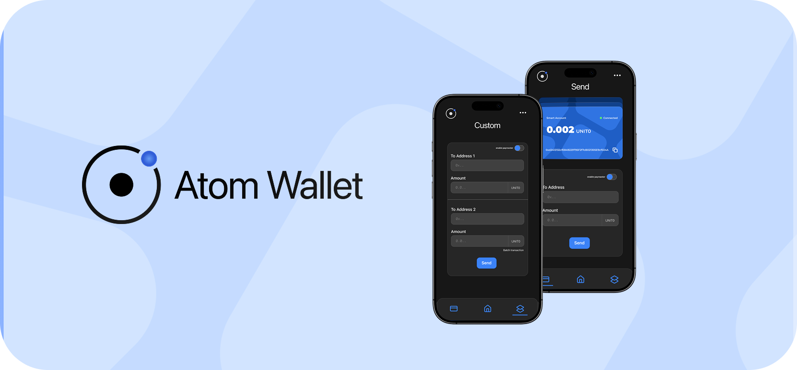

# Atom Wallet - First Agentic AI Smart Wallet on Sonic Network



Atom Wallet is a modern and user-friendly ERC4337 smart wallet application with AI-powered features. Enhanced with Account Abstraction technology, this wallet provides users with an advanced blockchain experience.

### ❗ For contracts, go to the contracts branch and review the documentation.

## Pitch deck

- [pitch deck](https://drive.google.com/file/d/1N1-ZwY1INrscPt2j_V2zwVG1bx1hJHiK/view?usp=sharing)

## 🌟 Features

### 🤖 AI-Powered Features

- LangChain and Google AI integration
- Smart transaction analysis and recommendations
- Natural language processing for wallet interactions
- Customized AI agents

### 💼 ERC4337 Integration

- Account Abstraction support
- Smart contract wallet capabilities
- Paymaster integration
- Batch transaction optimization

### 🔒 Security

- Multi-signature support
- Secure key management

## 🚀 Getting Started

### Requirements

- Node.js v18+

### Installation

1. Clone the repository

```bash
git clone https://github.com/Atom-Smart-Wallet/Atom-Smart-Wallet.git
```

2. Install dependencies

```bash
npm install
```

3. Set up environment variables

```bash
cp .env.example .env
# Edit the .env file
```

4. Start the development server

```bash
npm start
```

## 🛠 Technology Stack

### Frontend

- React + NextJs
- TypeScript

### Blockchain

- ethers.js v5.7.2
- ERC4337 integration
- Account Abstraction

### AI & Backend

- LangChain
- Google AI services


## 📦 Key Dependencies

```json
{
  "@langchain/core": "^0.3.40",
  "@langchain/google-genai": "^0.1.8",
  "ethers": "^5.7.2",
  "expo": "~52.0.36",
  "expo-router": "~4.0.17",
  "zustand": "^5.0.3"
}
```

## 🔧 Development

### Environment Variables

```env
GOOGLE_API_KEY=your_api_key
BUNDLER_URL=your_bundler_url
PAYMASTER_URL=your_paymaster_url
NETWORK_RPC_URL=your_rpc_url
CHAIN_ID=your_chain_id
ENTRYPOINT_ADDRESS=your_entrypoint_address
FACTORY_ADDRESS=your_factory_address
```

### Commands

```bash
npm start          # Start development server
npm run android    # Start for Android
npm run ios        # Start for iOS
npm test          # Run tests
npm run lint      # Run linting
```


## 🔬 Technical Details

### AI Features

#### Transaction Analysis Agent

  - Transaction security analysis
  - Automated transactions
  - Transaction explanations and recommendations

#### AI-Powered Features

- Natural language transaction creation

### Blockchain Services

#### Smart Wallet Structure

  - Local wallet management
  - Key generation and management
  - Transaction signing
  - Secure storage

#### Transaction Management

  - Transaction creation and management
  - Gas optimization
  - Batch transaction support
  - Transaction history

#### UserOperation Management

  - ERC4337 UserOperation creation
  - Signature validation
  - Paymaster integration
  - Gas estimation

#### Paymaster Integration

  - Sponsored transaction support
  - Gas token management
  - Paymaster policies
  - Limit controls

#### Contract Interactions


  - Smart contract calls
  - ABI management
  - Event listening
  - Contract state management

#### Wallet Services

  - Wallet state
  - Balance management
  - Token management
  - Address validation


## 🤝 Contributing

1. Fork the repository
2. Create a feature branch (`git checkout -b feature/amazing-feature`)
3. Commit your changes (`git commit -m 'feat: Add amazing feature'`)
4. Push to the branch (`git push origin feature/amazing-feature`)
5. Open a Pull Request

## 📄 License

This project is distributed under a proprietary license.

## 🤝 Support

- Report issues via GitHub Issues
- Join our Discord community
- Visit our documentation

## 👥 Team

- Product Manager: [alperenbekci](https://github.com/alperenbekci)
- Blockchain Engineer  : [murathankagan](https://github.com/murathanje)
